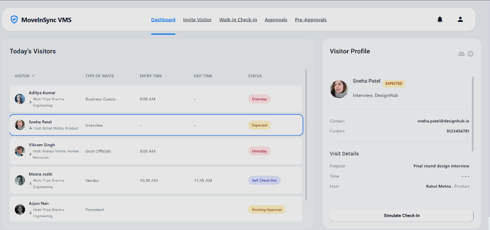
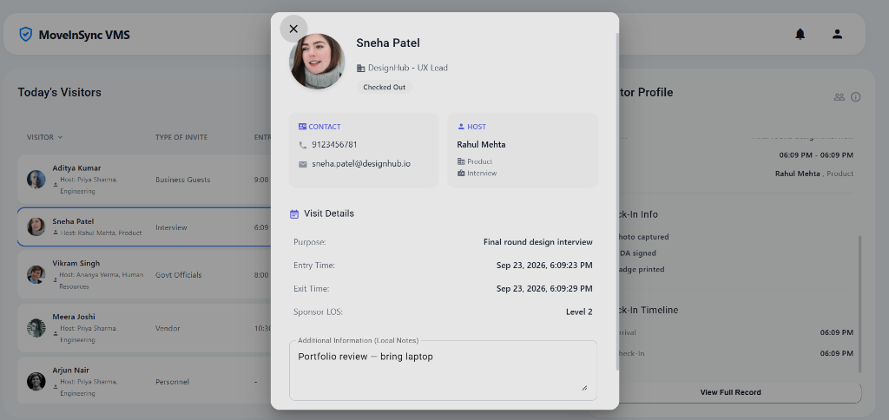
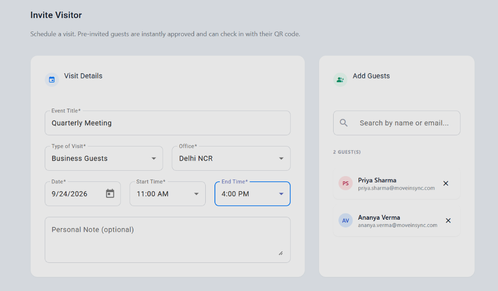
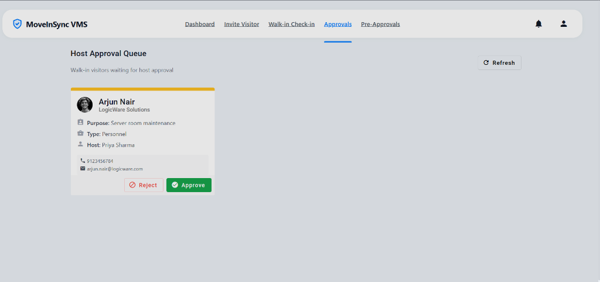
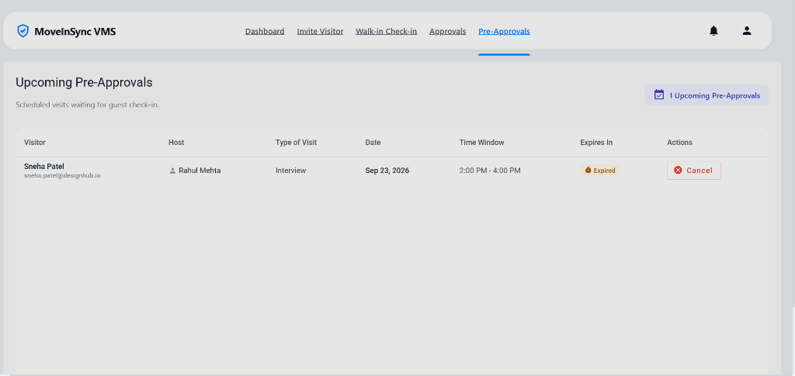

# 🛡️ MoveInSync — Visitor Management System

> **Frontend Intern Case Study · Project 1**  
> A fully client-side Visitor Management System built with Angular 18, Angular Signals, RxJS and Tailwind CSS.

<br>

## 🌐 Live Demo

**Deployed on Netlify:** *(add your Netlify URL here once deployed)*  
**GitHub Repository:** https://github.com/Aayushgarg23/Moveinsync_assignment

<br>

## 📸 Screenshots

### Dashboard — Today's Visitors


### Guest Detail Dialog


### Invite Visitor Form


### Host Approval Queue


### Pre-Approvals List


<br>

---

## 🛠️ Tech Stack

| Layer | Technology |
|---|---|
| Framework | Angular 18 (Standalone Components) |
| State Management | Angular Signals (`signal`, `computed`) |
| Async / Data Layer | RxJS (`of`, `delay`, `forkJoin`, `catchError`, `switchMap`) |
| Signals ↔ RxJS Bridge | `toSignal()` from `@angular/core/rxjs-interop` |
| UI Components | Angular Material (Dialogs, Snackbars, Buttons, Icons, Select, Datepicker) |
| Styling | Tailwind CSS (layout/spacing) + custom SCSS (Material token overrides) |
| Forms | Angular Reactive Forms (`FormGroup`, `FormBuilder`, `Validators`) |
| QR Code | `angularx-qrcode` |
| Build Tool | Angular CLI 18 |
| Deployment | Netlify (via `netlify.toml`) |

> **No backend. No database.** All data lives in an in-memory mock service with simulated RxJS `delay()` to demonstrate async patterns, loading states, and error handling.

<br>

---

## 📂 Project Structure

```
src/
├── app/
│   ├── components/
│   │   ├── app-shell/           # Root shell: floating navbar, hamburger, profile/notif menus
│   │   ├── dashboard/           # Today's visitor table + right-side detail panel
│   │   ├── invite-form/         # Pre-approval invite form + QR dialog trigger
│   │   ├── walk-in-form/        # Kiosk-style walk-in registration
│   │   ├── approvals/           # Host approval queue (approve / reject)
│   │   ├── pre-approvals/       # Pre-approved upcoming visits list
│   │   ├── guest-detail-dialog/ # Full visitor profile modal
│   │   └── qr-dialog/          # E-Pass / QR code popup
│   ├── models/
│   │   └── visitor.model.ts     # TypeScript interfaces: Visitor, Host, ApprovalRequest, PreApproval
│   ├── pipes/
│   │   └── visitor-status.pipe.ts  # Converts SNAKE_CASE enum → human-readable label
│   └── services/
│       └── visitor.service.ts   # Mock API service with in-memory store + RxJS simulation
```

<br>

---

## ✨ Features Implemented

### 1. 🏠 App Shell & Navigation
- Floating glassmorphic header with the **MoveInSync VMS** shield logo
- Desktop: horizontal nav with active-link underline indicator
- Mobile: hamburger → slide-in dropdown menu
- Notification bell (dropdown with empty state)
- User profile button → dropdown with Profile + Logout options

### 2. 📊 Front-Desk Dashboard
- **Today's Visitors** table: Visitor (name + host sub-text with department), Type of Invite, Entry Time, Exit Time, Status
- **Live Search** — filter by name, email, or phone
- **Status Filter** — All / Checked In / Pending / Pre-Approved / Overstay
- **Overstay Detection** — `computed()` signal automatically flags any visitor checked in for ≥ 8 hours
- **Visitor Detail Panel** — click any row to open:
  - Desktop: smooth right-hand sidebar with full profile
  - Mobile: scrollable popup modal
- **Check-Out Button** in detail panel / dialog
- **View Full Record** button to open the full Guest Detail dialog from the sidebar

### 3. 📨 Invite Visitor (Pre-Approval Path)
- Fill out Event Title, Type of Visit, Office, Date, Start/End Time window
- Search and add multiple guests (searches existing visitors + hosts)
- Added guests shown with colorful **initials avatars** (no photo upload needed)
- On submit: visitor created with `PRE_APPROVED` status → **QR E-Pass dialog** opens immediately
- Enforces **max 5 pre-approvals per host per day** with error feedback
- Pre-approved visitors auto-expire when their time window passes (`checkAndExpirePasses()`)

### 4. 🚶 Walk-In Registration
- Full registration form: Full Name, Company, Phone, Email, Purpose, Host, Visit Type
- Simulates **webcam photo capture** (with file-upload fallback)
- NDA Signed + Badge Printed toggle switches
- On submit: visitor created with `PENDING_APPROVAL` status → sent to the **Host Approval Queue**
- If no photo is captured, a colorful **auto-generated initials avatar** (SVG data-URI) is assigned

### 5. ✅ Host Approval Queue
- Cards for all walk-in visitors awaiting host decision
- **Approve** → visitor status becomes `CHECKED_IN`, card removed from queue, visitor appears on Dashboard
- **Reject** → visitor status becomes `DENIED`, card removed
- Refresh button to re-poll the in-memory store

### 6. 📅 Pre-Approvals List
- Table of all upcoming invited visitors with time windows
- **Expired** badge for visitors whose time window has already passed
- Cancel button to remove a pre-approval record

### 7. 👤 Guest Detail Dialog
- Full visitor profile: avatar, name, company, role, status badge
- Contact section: phone + email
- Host section: name + **department** (e.g. "Rahul Mehta, Product")
- Visit Details: Purpose, Entry/Exit Time, Sponsor LOS, Temp Card No
- Check-In Timeline: Arrival → Check-In → Check-Out timestamps
- Editable **Additional Information** free-text notes field
- Context-aware action buttons: **Simulate Check-In** (PRE_APPROVED) or **Check-Out** (CHECKED_IN / OVERSTAY)

<br>

---

## 🔄 Page Inter-Relations & Full Workflows

```
Invite Form
    │  (status: PRE_APPROVED)
    ▼
Pre-Approvals List ──► [Simulate Check-In] ──► Dashboard (CHECKED_IN)

Walk-In Form
    │  (status: PENDING_APPROVAL)
    ▼
Host Approval Queue
    ├── [Approve] ──► Dashboard (CHECKED_IN)
    └── [Reject]  ──► Dashboard (DENIED)

Dashboard
    └── Click Row ──► Detail Panel / Dialog
                           └── [Check-Out] ──► Dashboard (CHECKED_OUT)
```

<br>

---

## ⏱️ Time & Space Complexity Analysis

### Dashboard — Visitor Loading & Filtering

| Operation | Time Complexity | Notes |
|---|---|---|
| Load visitors + hosts | O(V + H) | Single forkJoin; H = host count, V = visitor count |
| Join host to visitor | O(V × H) | `Array.find()` per visitor — negligible at realistic scale |
| Overstay computed signal | O(V) | One pass over all visitors on every reactive recalculation |
| Search filter | O(V) | Linear scan of name/email/phone strings |
| Space | O(V + H) | Two in-memory arrays |

### Pre-Approval Limit Check

| Operation | Time Complexity | Notes |
|---|---|---|
| `getPreApprovalCountForHost()` | O(V) | Filters visitor array by hostId + date + status |

### Auto-Expiry Scan

| Operation | Time Complexity | Notes |
|---|---|---|
| `checkAndExpirePasses()` | O(V) | Single `forEach` over all visitors |

> **At 10,000 visitors/day:** The in-memory approach stays O(V) but RAM usage grows linearly. A real implementation would use paginated API calls (e.g. `GET /visitors?page=1&limit=50&date=today`) so only the current page is held in memory — keeping the UI bundle constant at O(page_size).

<br>

---

## 📈 Scalability Notes (10,000 Visitors/Day)

1. **Pagination** — Replace `getVisitors$()` returning the full array with a paginated endpoint. The dashboard table would request one page at a time, keeping memory usage constant.
2. **Server-Side Filtering** — Move search and status filters to query parameters (`?search=aditya&status=CHECKED_IN`) so the server returns only matching rows.
3. **WebSocket / SSE for Real-Time** — Replace the manual "Refresh" button on the Approvals page with a WebSocket subscription so host approvals appear instantly without polling.
4. **Indexed DB / Service Worker** — For offline kiosk usage, cache visitor data in IndexedDB and sync on reconnection.
5. **Virtual Scrolling** — For very large lists, `@angular/cdk/scrolling`'s `VirtualScrollViewport` renders only visible rows.
6. **CDN Image Caching** — Store visitor photos on a CDN (e.g. S3 + CloudFront) rather than data-URIs to reduce payload size.

<br>

---

## 🚀 Local Setup & Running

### Prerequisites
- Node.js 18+
- npm 9+

### Install & Run

```bash
# Clone the repository
git clone https://github.com/Aayushgarg23/Moveinsync_assignment.git
cd Moveinsync_assignment/Project1_VisitorManagementSystem_AayushGarg

# Install dependencies
npm install

# Start development server
npx -p @angular/cli@18 ng serve

# Open in browser
# http://localhost:4200
```

### Production Build

```bash
npx -p @angular/cli@18 ng build --configuration=production
# Output → dist/moveinsync-vms-app/browser/
```

<br>

---

## 🎯 Demo Flow (Assignment Required Sequence)

1. **Register via Invite (Pre-Approval path)**
   - Go to **Invite Visitor** → fill form → add guests → Submit
   - QR E-Pass dialog appears → close it
   - Go to **Pre-Approvals** → see the pending card → click **Simulate Check-In**
   - Go to **Dashboard** → visitor now shows as **Checked In** ✅

2. **Register via Walk-In path**
   - Go to **Walk-in Check-in** → fill form → toggle Photo/NDA → Submit
   - Go to **Approvals** → card appears in queue → click **Approve**
   - Go to **Dashboard** → visitor now shows as **Checked In** ✅

3. **Check-Out**
   - On Dashboard, click any **Checked In** visitor row
   - Click **Check-Out** in the detail panel → status changes to **Checked Out** ✅

4. **Overstay Detection**
   - Aditya Kumar in mock data has a check-in time 9 hours ago
   - Dashboard automatically shows his status as **Overstay** (red badge) ✅

<br>

---

## 👤 Author

**Aayush Garg**  
Frontend Intern Applicant — MoveInSync  
GitHub: [@Aayushgarg23](https://github.com/Aayushgarg23)
